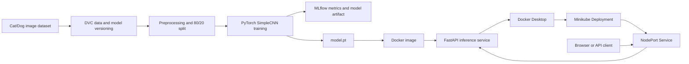

# Cats vs Dogs MLOps Report

## 1. Project Overview

This project implements an image classifier that predicts whether an uploaded image contains a cat or a dog. The solution packages a PyTorch convolutional neural network behind a FastAPI service, tracks training with MLflow, versions data and model artifacts with DVC, and supports container deployment through Docker and Minikube.

**Code repository:** [Open the project source](../)

## 2. Setup and Installation

### Prerequisites

- Python 3.10
- Docker Desktop
- kubectl
- Minikube
- Git and DVC

### Local setup

From the repository root:

```powershell
python -m venv .venv
.\.venv\Scripts\Activate.ps1
python -m pip install --upgrade pip
python -m pip install -r requirements.txt
```

Restore DVC-managed files when the configured DVC remote is available:

```powershell
dvc pull
```

The training dataset is expected at `data/PetImages/Cat` and `data/PetImages/Dog`. The trained model is expected at `model.pt`.

### Run tests and the API

```powershell
pytest -q
uvicorn src.inference:app --host 0.0.0.0 --port 8000
```

Open `http://localhost:8000/`. The service health endpoint is `http://localhost:8000/health`.

The inference test requires `model.pt`. The dataset tests require a dataset at the path used by the test (`data/train`); the training code itself uses `data/PetImages`. Ensure the test fixture or path is aligned before treating the complete test suite as the release gate.

### Docker

```powershell
docker build -t cats-dogs-mlops:latest .
docker run --rm -p 8000:8000 cats-dogs-mlops:latest
```

## 3. Exploratory Data Analysis

The dataset is arranged into two labelled directories:

```text
data/PetImages/
  Cat/
  Dog/
```

The dataset loader walks both directories, assigns label `0` to `Cat` and label `1` to `Dog`, converts every image to RGB, resizes it to `224 x 224`, applies a random horizontal flip during training, and converts it to a PyTorch tensor.

Recommended EDA checks before training are:

- Count images in each class and confirm class balance.
- Identify unreadable files and duplicate images.
- Inspect image dimensions and aspect ratios.
- Display representative samples from both classes.
- Confirm that labels are assigned consistently.

The data is split into 80% training and 20% validation subsets using `random_split`.

## 4. Modelling Choices

The classifier is a compact custom CNN implemented in `src/model.py`:

- Convolution block 1: 3 input channels to 32 channels, ReLU, max pooling.
- Convolution block 2: 32 channels to 64 channels, ReLU, max pooling.
- Flattened feature representation: `64 x 56 x 56`.
- Fully connected layer: 128 hidden units with ReLU.
- Output layer: 2 logits for cat and dog.

Training uses:

- Cross-entropy loss.
- Adam optimizer.
- Learning rate `0.001`.
- Batch size `32`.
- Five epochs.
- Validation accuracy logged after every epoch.

Inference applies RGB conversion, resizing to `224 x 224`, tensor conversion, and `argmax` over the two output logits. The model is evaluated under `torch.no_grad()`.

## 5. Experiment Tracking Summary

MLflow is started in `src/train.py` and records one training run. For each epoch, the validation accuracy is logged with the metric name `val_acc`. The trained PyTorch model is also logged under the MLflow artifact path `model`.

The local MLflow files are stored in `mlruns/`. A run summary can be inspected with:

```powershell
mlflow ui --backend-store-uri ./mlruns
```

Then open the URL printed by MLflow, normally `http://127.0.0.1:5000`.

| Item | Recorded value |
|---|---|
| Tracking framework | MLflow |
| Training epochs | 5 |
| Logged metric | Validation accuracy (`val_acc`) |
| Logged model | PyTorch model under `model` |
| Local tracking store | `mlruns/` |
| Model file used by API | `model.pt` |

Record the final validation accuracy from the MLflow UI in the table below before submission:

| Run | Final `val_acc` | Notes |
|---|---:|---|
| Local training run | _Add value from MLflow_ | Five-epoch training run |

## 6. System Architecture



### Request flow

1. A client uploads an image to `POST /predict`.
2. FastAPI receives the multipart upload.
3. PIL converts the image to RGB.
4. Torchvision resizes and tensorizes the image.
5. `SimpleCNN` produces two class logits.
6. The API returns `cat` or `dog` as JSON.

## 7. CI/CD Workflow

The workflow is defined in [.github/workflows/ci-cd.yml](../.github/workflows/ci-cd.yml).

### Continuous integration

For pull requests and pushes, GitHub Actions:

1. Checks out the repository.
2. Installs Python 3.10 and pytest.
3. Compiles the `src` package to catch syntax errors.

### Continuous delivery

For pushes to `main`, the workflow:

1. Checks that `model.pt` is available.
2. Authenticates to GitHub Container Registry using `GITHUB_TOKEN`.
3. Builds the Docker image.
4. Publishes both `latest` and commit-specific image tags.

The local DVC remote currently points to `../dvcstore`. A cloud-accessible DVC remote or another CI artifact store is required for GitHub Actions to restore `model.pt` in a clean runner.

## 8. Minikube Deployment

Start Minikube and select its context:

```powershell
minikube start --driver=docker
kubectl config use-context minikube
```

Build and load the image:

```powershell
docker build -t cats-dogs-mlops:latest .
minikube image load cats-dogs-mlops:latest
```

Deploy the two-replica application and service:

```powershell
kubectl apply -f k8s.yaml
kubectl rollout status deployment/catsdogs-deploy
kubectl get pods -l app=catsdogs
```

On Windows with the Docker driver, access the service reliably with port forwarding:

```powershell
kubectl port-forward service/catsdogs-svc 8000:80
```

Open `http://localhost:8000/` and verify `http://localhost:8000/health` returns:

```json
{"status":"ok"}
```

Useful operational commands:

```powershell
kubectl logs deployment/catsdogs-deploy
kubectl describe pods -l app=catsdogs
kubectl get service catsdogs-svc
```

## 9. Evidence Screenshots

Add the following screenshots to the final submission. Suggested filenames are shown below.

| Evidence | What the screenshot should show | Suggested file |
|---|---|---|
| CI pipeline | Successful GitHub Actions validation job | `docs/screenshots/ci-success.png` |
| Image publishing | Successful Docker/GHCR build on `main` | `docs/screenshots/cd-success.png` |
| MLflow tracking | Run page with `val_acc` metrics and model artifact | `docs/screenshots/mlflow-run.png` |
| Minikube deployment | `kubectl get pods` showing two `1/1 Running` pods | `docs/screenshots/minikube-pods.png` |
| Running application | Browser showing the classifier page or `/health` response | `docs/screenshots/application.png` |

After adding the files, replace this section with image links such as:

```markdown

```

## 10. Conclusion

The project demonstrates an end-to-end MLOps workflow: versioned data and model artifacts, repeatable model training, MLflow experiment tracking, a FastAPI prediction endpoint, Docker packaging, automated CI/CD, and local Kubernetes deployment through Minikube.

## 11. Command Reference

| Command | Short description |
|---|---|
| `git add .` | Stages project changes for a commit. |
| `git commit -m "message"` | Records staged changes in Git history. |
| `git push origin main` | Uploads the latest commit to GitHub. |
| `dvc add data/PetImages` | Creates DVC metadata for the dataset. |
| `dvc add model.pt` | Creates DVC metadata for the trained model. |
| `dvc push` | Uploads DVC-tracked files to the configured remote. |
| `docker build -t cats-dogs-mlops:latest .` | Builds the application container image. |
| `docker run -p 8000:8000 cats-dogs-mlops:latest` | Runs the API locally on port 8000. |
| `minikube start --driver=docker` | Starts a local Kubernetes cluster. |
| `minikube image load cats-dogs-mlops:latest` | Makes the local image available inside Minikube. |
| `kubectl apply -f k8s.yaml` | Creates or updates the deployment and service. |
| `kubectl rollout status deployment/catsdogs-deploy` | Waits for the deployment to become ready. |
| `kubectl port-forward service/catsdogs-svc 8000:80` | Exposes the service at `localhost:8000`. |
| `pytest -q` | Runs the automated Python tests. |
| GitHub Actions workflow | Validates code and publishes the Docker image on `main`. |
